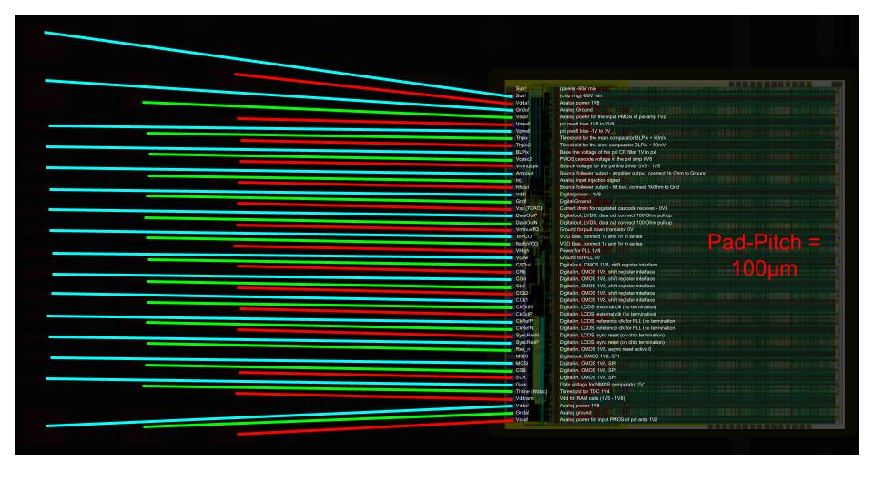
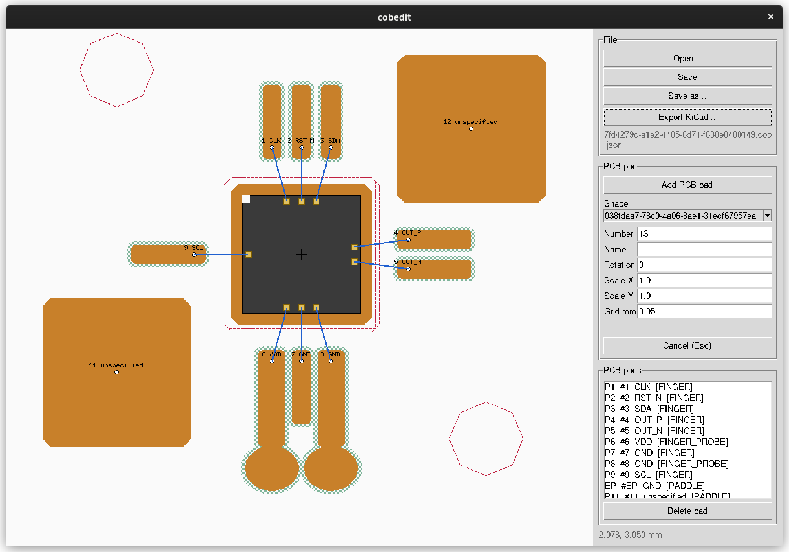
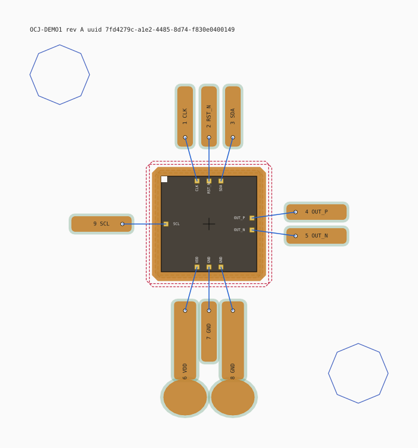

# open.cob.json

An open, canonical, machine-readable format for exchanging Chip-on-Board (COB)
wire-bonding information between chip designers and PCB designers.

> **Status: work in progress.** Nothing here is stable yet. Meaningful
> intermediate states will be frozen with git tags.

## The problem

When you design a chip, you send your GDS files to a manufacturer such as
[wafer.space](https://wafer.space). Some months later the bare dies come back,
and now you have to connect them to the outside world. Chip-on-Board wire
bonding is one way to do that: the die is glued directly onto the PCB and thin
wires are bonded from the chip pads to matching pads on the board.

I have done this many times myself and covered parts of the process in my
[KiCon talk](https://youtu.be/dNBwY7L6niI).

The hard question is not the bonding itself. It is: **how do you prepare the
PCB so that it can actually be bonded correctly?** Which chip pad goes to
which board pad? How long may a given wire become? What does the land pattern
look like, and where do cutouts and courtyards go? These questions are
surprisingly hard to answer, especially while the land pattern itself is still
undefined.

In every project I have worked on, this information existed, but it was
scattered across images, SVGs, PowerPoint slides, spreadsheets, electrical
specifications and geometric drawings. A typical bonding plan looks like this:



It works, but it is not machine-readable, it drifts out of sync with the
design, and every project reinvents it.

## The observation

Designing the PCB, the bonding and the testing always follows the same
pattern. Each piece of information has one authoritative source:

| Information | Determined by |
|---|---|
| Where the chip pads are | the GDS files |
| Electrical properties of each pad (supply, I/O standard, bias, ESD, ...) | the chip designer's schematic |
| Pad metallization, and therefore wire material, bond force, temperature, ... | the manufacturing process |
| Wire length | the position of the matching pad on the PCB |
| Limits on wire length and loop shape | current load, EMC, differential vs. single-ended signalling |

From these inputs, a land pattern for the PCB, including cutouts and
courtyards, can be derived. So can bonding parameters and a test plan.

## The idea

A few years ago I started capturing this data for my own chips in JSON files.
This repository is an attempt to turn that into an open, canonical format,
`*.cob.json`, that:

- describes **chip pads**, **PCB pads** and **wire parameters** in one file,
  with reusable pad geometries in a catalog of `*.shape.cob.json` files,
- can be exchanged between chip designers, PCB designers and bonding services,
- is a sufficient input to **generate land patterns, bonding parameters and
  tests automatically**,
- is initially limited to **wire bonding**, but leaves room for other
  Chip-on-Board techniques such as flip-chip later on.

On 2026-09-15 I had a long conversation with Stuart Childs of wafer.space, who
encouraged me to write my thoughts on this down in an orderly way. This
repository is the result.

## Preliminary roadmap

This is a first sketch and will change.

1. **Write-up** of the problem, the data model and the design goals (this
   README and `docs/`).
2. **Draft data model**: define the entities (die, PCB, wires, assembly)
   and their relationships in prose. A first draft lives in
   [`docs/data-model-draft.md`](docs/data-model-draft.md).
3. **JSON Schema** for `*.cob.json`, versioned, with an explicit extension
   mechanism for future bonding techniques.
4. **Example files**. A fictional chip and three pad shapes live in
   [`examples/`](examples/).
5. **Visualizer and editor**: [`tools/cobviz`](tools/cobviz/) renders a
   `*.cob.json` file as an SVG so a bonding plan can be checked by eye.
   [`tools/cobedit`](tools/cobedit/) is a small Tkinter editor that shows
   the same geometry and lets you place PCB pads from the shape catalog.
6. **Validator**: a small tool that checks a `*.cob.json` file against the
   schema and against physical constraints (wire length, pitch, angles).
7. **Land pattern generator**: derive PCB pads, cutouts and courtyards from a
   `*.cob.json` file.
8. **KiCad integration**: [`tools/cobkicad`](tools/cobkicad/) generates a
   symbol library and a footprint for KiCad 9 and 10. A KiCad plugin that
   imports `*.cob.json` directly may follow.
9. **Layout import**: [`tools/cobgen`](tools/cobgen/) reads GDSII or
   OASIS and writes the `die` block, everything else `unspecified`.
10. **Bonding parameter and test generation**.

Tags will mark the state after each step that is worth freezing.

## Tools

All tools are small Python projects run with [uv](https://docs.astral.sh/uv/).
No installation is needed beyond uv itself; `uv run` creates the
environment on first use.

| Tool | Purpose |
|---|---|
| [`tools/cobviz`](tools/cobviz/) | render a `.cob.json` as SVG |
| [`tools/cobedit`](tools/cobedit/) | Tkinter editor: view, place PCB pads, export KiCad |
| [`tools/cobkicad`](tools/cobkicad/) | KiCad symbol and footprint from the command line |
| [`tools/cobgen`](tools/cobgen/) | `die` block from a GDSII or OASIS layout |

### Try it: KiCad symbol and footprint from the example files

The fictional demo chip in `examples/demo-chip/` is complete, so it can be
turned into a KiCad library directly:

```bash
git clone https://github.com/MaxClerkwell/open.cob.json.git
cd open.cob.json/tools/cobkicad
uv run cobkicad --file ../../examples/demo-chip/7fd4279c-a1e2-4485-8d74-f830e0400149.cob.json --out ./out
```

This writes `out/OCJ-DEMO1.kicad_sym` and
`out/open_cob.pretty/COB_OCJ-DEMO1.kicad_mod`. Add `out/` as a symbol
library and `out/open_cob.pretty` as a footprint library in KiCad 9 or 10,
and the symbol `OCJ-DEMO1` with its footprint is ready to place.

To check what was written without opening KiCad:

```bash
kicad-cli sym export svg --output ./out/svg ./out/OCJ-DEMO1.kicad_sym
kicad-cli fp  export svg --output ./out/svg --layers "F.Cu,F.Mask,F.SilkS,Dwgs.User" ./out/open_cob.pretty
```

### Try it: place pads in the editor and export

The same demo chip can be opened in the editor, changed, and exported
again:

```bash
cd tools/cobedit
uv run cobedit --file ../../examples/demo-chip/7fd4279c-a1e2-4485-8d74-f830e0400149.cob.json
```

1. Click **Add PCB pad** and pick a shape. The three shapes from
   `examples/shapes/` are found automatically because they live next to the
   file.
2. Enter number and name, set the rotation, move over the canvas and click.
   `R` rotates, `Esc` cancels, the wheel zooms, right drag pans.
3. **Export KiCad...** writes symbol and footprint from the current state.
   **Save as...** keeps the `.cob.json` if you want to continue later.

Note that `cobedit` cannot add wires yet. Pads placed in the editor show up
in the footprint and the symbol, but the bond wires between die pads and
PCB pads still have to be written into the `wires` block of the
`.cob.json` by hand, or come from a file that already has them, like the
demo chip.

To start from a real bare die instead, run `cobgen` on a layout first. It
writes a die-only file with the chip pads filled in and the PCB side
`unspecified`, which is exactly what the editor expects. The
[wafer.space example layouts](https://github.com/wafer-space/gf180mcu-example-layouts)
are a good source; they are not part of this repository.



### Other commands

```bash
# render a bonding plan as SVG
cd tools/cobviz
uv run cobviz --file ../../examples/demo-chip/<uuid>.cob.json --plot demo.svg

# generate the die block from a GDSII / OASIS layout
cd tools/cobgen
uv run cobgen --file chip_top.oas --pdk gf180mcu --out chip_top.cob.json
```

This is what the fictional demo chip in `examples/` looks like when
rendered by `cobviz`: die with notch and pads, die attach paddle, via
keepout, bond fingers with bond targets, two probe fingers, fiducials and
the wedge wires.



## Try it with your own chip

The best test for this format is a chip that is not mine. If you have a
GDS or OASIS file of your own design, run it through `cobgen`, open the
result in `cobedit`, place a few pads and export to KiCad. Then
[open an issue](https://github.com/MaxClerkwell/open.cob.json/issues) and
tell me what broke, what was missing, or what the format could not express.
Pad layers of a PDK I have not seen, unusual pad shapes, multi-die modules,
anything. A short report with the PDK name and a description of your
padframe is enough; the layout itself does not need to be shared.

## Contributing

Ideas, questions and objections are welcome. Please open an issue or start a
discussion. Since the format is still being shaped, discussion is currently
more valuable than pull requests.

## License

This work, including the format specification, documentation, examples and
tools, is licensed under the
[Creative Commons Attribution 4.0 International License](https://creativecommons.org/licenses/by/4.0/)
(CC BY 4.0). See [`LICENSE`](LICENSE).

You may copy, modify, fork and use it commercially, as long as you credit
the original work and indicate if changes were made. Suggested attribution:

> open.cob.json by Stephan Bökelmann, https://github.com/MaxClerkwell/open.cob.json,
> licensed under CC BY 4.0.

## Author

Stephan Bökelmann, [maxclerkwell.tech](https://maxclerkwell.tech)
